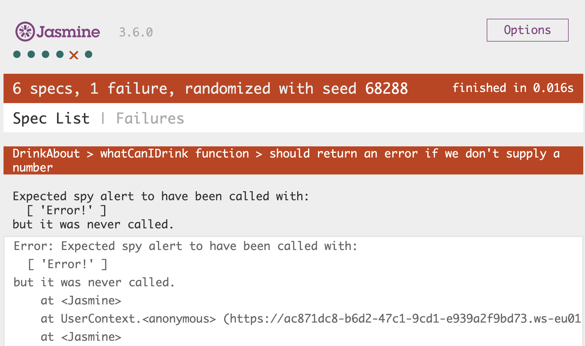

# **Drink About Game**

## **Challenge**

Your challenge is to write some tests for the Drink About game.

Drink About is a simple function that will check the age and return a drink appropriate for your age. Create a function called whatCanIDrink. This function should take in age as parameter. The function should do the following:

- If the age is less than 0, then it should return "Sorry. I can’t tell what drink because that age is incorrect!"

- If the age is less than 14, then it should return "Drink Toddy"

- If the age is less than 18, then it should return "Drink Coke"

- If the age is less than 21, then it should return "Drink Beer"

- If the age is less than 130, then it should return "Drink Whisky"

- Else return "Sorry. I can’t tell what drink because that age is incorrect!"

### **Project**

I have tried to work through the challenge following the example given in the CI training videos.

For each step I have saved the Jasmine files: drinkSpecStep01.js, drinkSpecStep02, etc.

And for each step I have saved the corresponding JavaScript files in the same way:
drinkStep01.js, drinkStep02.js etc.

- step01 and step02 refers to Red-Green-Refactor.
- step03 and step04 refer to Test suites.
- step05 refers to the Defensive programming.
- step06 refers to Spies.

#### **Example of Jasmine Error**

In step06 before amending drink.js get the following error as expected.

Change "return" to "alert" in drink.js at end of if else statement to fix. Now all specs in calcDrink pass.
